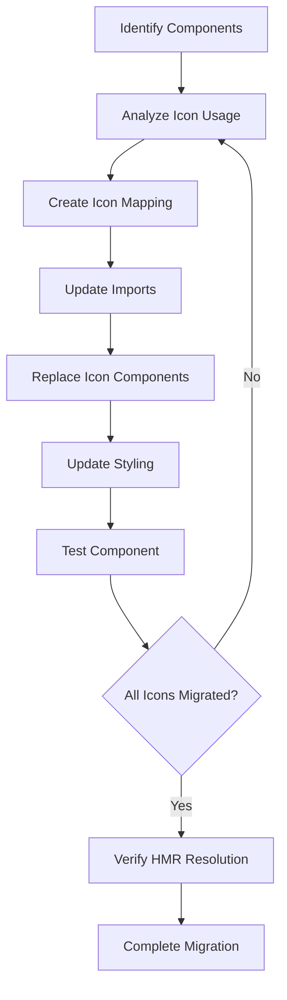

# Design Document

## Overview

This design outlines a systematic approach to migrate all Heroicons usage in AI-PM components to Ant Design icons, resolving HMR module factory conflicts and establishing a consistent icon system.

## Architecture

### Migration Strategy
- **Incremental Replacement**: Replace icons file by file to minimize disruption
- **Mapping-Based Approach**: Create a comprehensive mapping between Heroicons and Ant Design icons
- **Validation System**: Implement checks to ensure complete migration

### Component Scope
Based on codebase analysis, the following AI-PM components require migration:
- `DocumentEditor.tsx`
- `DocumentManager.tsx` 
- `AIChatPanel.tsx`
- `ConversationHistoryPanel.tsx`
- `MemberManagement.tsx` (already partially migrated)
- Any other AI-PM components using Heroicons

## Components and Interfaces

### Icon Mapping System

```typescript
interface IconMapping {
  heroicon: string;
  antdIcon: string;
  size?: 'small' | 'default' | 'large';
  customStyle?: React.CSSProperties;
}

const ICON_MAPPINGS: Record<string, IconMapping> = {
  'PlusIcon': {
    heroicon: 'PlusIcon',
    antdIcon: 'PlusOutlined',
    size: 'default'
  },
  'TrashIcon': {
    heroicon: 'TrashIcon', 
    antdIcon: 'DeleteOutlined',
    size: 'default'
  },
  'PencilIcon': {
    heroicon: 'PencilIcon',
    antdIcon: 'EditOutlined',
    size: 'default'
  },
  'EyeIcon': {
    heroicon: 'EyeIcon',
    antdIcon: 'EyeOutlined',
    size: 'default'
  },
  'CheckIcon': {
    heroicon: 'CheckIcon',
    antdIcon: 'CheckOutlined',
    size: 'default'
  },
  'XMarkIcon': {
    heroicon: 'XMarkIcon',
    antdIcon: 'CloseOutlined',
    size: 'default'
  },
  'DocumentTextIcon': {
    heroicon: 'DocumentTextIcon',
    antdIcon: 'FileTextOutlined',
    size: 'default'
  },
  'ClockIcon': {
    heroicon: 'ClockIcon',
    antdIcon: 'ClockCircleOutlined',
    size: 'default'
  },
  'ExclamationTriangleIcon': {
    heroicon: 'ExclamationTriangleIcon',
    antdIcon: 'ExclamationTriangleOutlined',
    size: 'default'
  },
  'ArrowPathIcon': {
    heroicon: 'ArrowPathIcon',
    antdIcon: 'ReloadOutlined',
    size: 'default'
  },
  'ChatBubbleLeftRightIcon': {
    heroicon: 'ChatBubbleLeftRightIcon',
    antdIcon: 'MessageOutlined',
    size: 'default'
  },
  'LightBulbIcon': {
    heroicon: 'LightBulbIcon',
    antdIcon: 'BulbOutlined',
    size: 'default'
  },
  'EllipsisVerticalIcon': {
    heroicon: 'EllipsisVerticalIcon',
    antdIcon: 'MoreOutlined',
    size: 'default'
  },
  'ArrowDownTrayIcon': {
    heroicon: 'ArrowDownTrayIcon',
    antdIcon: 'DownloadOutlined',
    size: 'default'
  },
  'MagnifyingGlassIcon': {
    heroicon: 'MagnifyingGlassIcon',
    antdIcon: 'SearchOutlined',
    size: 'default'
  },
  'FunnelIcon': {
    heroicon: 'FunnelIcon',
    antdIcon: 'FilterOutlined',
    size: 'default'
  },
  'DocumentArrowDownIcon': {
    heroicon: 'DocumentArrowDownIcon',
    antdIcon: 'FileDownloadOutlined',
    size: 'default'
  },
  'CalendarDaysIcon': {
    heroicon: 'CalendarDaysIcon',
    antdIcon: 'CalendarOutlined',
    size: 'default'
  },
  'ChartBarIcon': {
    heroicon: 'ChartBarIcon',
    antdIcon: 'BarChartOutlined',
    size: 'default'
  },
  'ArchiveBoxIcon': {
    heroicon: 'ArchiveBoxIcon',
    antdIcon: 'InboxOutlined',
    size: 'default'
  },
  'ArrowUpIcon': {
    heroicon: 'ArrowUpIcon',
    antdIcon: 'ArrowUpOutlined',
    size: 'default'
  },
  'DocumentDuplicateIcon': {
    heroicon: 'DocumentDuplicateIcon',
    antdIcon: 'CopyOutlined',
    size: 'default'
  },
  'EyeSlashIcon': {
    heroicon: 'EyeSlashIcon',
    antdIcon: 'EyeInvisibleOutlined',
    size: 'default'
  }
};
```

### Migration Workflow



## Data Models

### Component Analysis Result
```typescript
interface ComponentAnalysis {
  filePath: string;
  heroiconsUsed: string[];
  importStatement: string;
  iconUsageLocations: Array<{
    line: number;
    iconName: string;
    context: string;
  }>;
}
```

### Migration Task
```typescript
interface MigrationTask {
  component: string;
  heroicon: string;
  antdIcon: string;
  replacementCode: string;
  status: 'pending' | 'in-progress' | 'completed';
}
```

## Error Handling

### HMR Conflict Resolution
1. **Module Cache Clearing**: Implement file renaming strategy to force module reload
2. **Import Isolation**: Ensure no mixed imports within same component
3. **Dependency Cleanup**: Remove all Heroicons imports before adding Ant Design imports

### Fallback Strategies
1. **Icon Not Found**: Use generic Ant Design icon with warning
2. **Style Mismatch**: Apply custom CSS to match original appearance
3. **Size Inconsistency**: Use Ant Design's size system with custom adjustments

## Testing Strategy

### Unit Testing
- Verify each migrated component renders without errors
- Test icon click handlers and interactions
- Validate styling consistency

### Integration Testing  
- Test HMR functionality after migration
- Verify no module factory errors occur
- Test complete AI-PM workflow with new icons

### Visual Regression Testing
- Compare before/after screenshots
- Ensure icon alignment and spacing
- Validate color and hover states

### Performance Testing
- Measure bundle size impact
- Test loading performance
- Verify memory usage patterns

## Implementation Phases

### Phase 1: Analysis and Mapping
1. Scan all AI-PM components for Heroicons usage
2. Create comprehensive icon mapping
3. Document current styling patterns

### Phase 2: Core Component Migration
1. Migrate `DocumentEditor.tsx`
2. Migrate `DocumentManager.tsx`
3. Migrate `AIChatPanel.tsx`
4. Test each component individually

### Phase 3: Remaining Components
1. Migrate `ConversationHistoryPanel.tsx`
2. Complete `MemberManagement.tsx` migration
3. Handle any additional components

### Phase 4: Validation and Cleanup
1. Verify no Heroicons imports remain
2. Test HMR functionality
3. Validate visual consistency
4. Performance optimization

## Design Decisions

### Icon Library Choice
- **Ant Design Icons**: Chosen for consistency with existing UI components
- **Outline Style**: Maintains visual consistency with current Heroicons outline style
- **Size System**: Leverage Ant Design's built-in size system

### Styling Approach
- **CSS-in-JS**: Use inline styles for icon-specific customizations
- **Theme Integration**: Align with Ant Design theme system
- **Responsive Design**: Maintain current responsive behavior

### Migration Strategy
- **File-by-File**: Migrate entire files at once to avoid mixed imports
- **Backup Strategy**: Create backups before major changes
- **Incremental Testing**: Test each component after migration

This design ensures a systematic, safe, and thorough migration from Heroicons to Ant Design icons while resolving HMR conflicts and maintaining visual consistency.